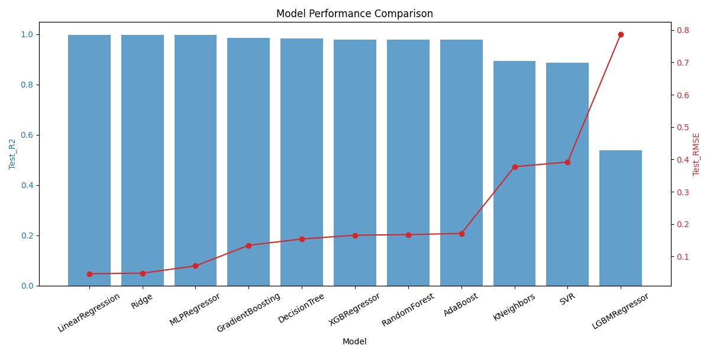
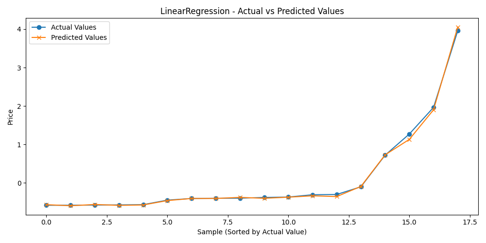

# THYAO Regression Project

This repository contains a modular machine learning pipeline for predicting the "Highest Price" in the THYAO dataset. The project includes data preprocessing, model training, evaluation, and visualization.

## 📁 Project Structure

```
THYAO_Project/
│
├── data/
│   ├── THYAO_Regression_Data.csv
│   └── preprocessed_THYAO.csv
│
├── images/                # Model prediction plots (auto-generated)
├── models/                # Saved best model (auto-generated)
├── outputs/               # Model results CSV (auto-generated)
│
├── notebooks/
│   └── eda.ipynb          # Exploratory Data Analysis notebook
│
├── src/
│   ├── data_preprocessing.py
│   ├── model_utils.py
│   ├── plot_utils.py
│   └── train_model.py
│
├── main.py
├── requirements.txt
├── README.md
└── .gitignore
```

## 📊 Results

- **Model Evaluation Metrics**:  Bar chart comparing key performance metrics (Best val accuracy, test accuracy, F1 score)



- **Predicted Chart**: Visual representation of the model's true positives, false positives, true negatives, and false negatives



## 📄 Dataset Information

The dataset used in this project was collected, curated, and organized by myself from various reliable sources. All preprocessing and feature engineering steps were performed to ensure the dataset's suitability for regression modeling.  
You can also find and download the dataset on Kaggle: [Kaggle Dataset Link](https://www.kaggle.com/datasets/ozanguneyli/turkish-airlines-thyao-dataset-for-ml-models/data)

If you have any suggestions or feedback regarding the dataset, modeling approach, or the overall project, please feel free to share them. Your input is highly appreciated and will help improve the quality of this work.

## 🚀 How to Run

1. **Install dependencies**
    ```bash
    pip install -r requirements.txt
    ```

2. **Run the pipeline**
    ```bash
    python main.py
    ```

3. **Outputs**
    - Model results: `outputs/model_results.csv`
    - Best model weights: `models/<BestModel>.pkl`
    - Prediction plots: `images/`

## 📊 Notebooks

- `notebooks/eda.ipynb`: Explore the data, visualize distributions, trends, and correlations.

## 🛠️ Main Scripts

- `src/data_preprocessing.py`: Data cleaning, outlier handling, scaling.
- `src/model_utils.py`: Model definitions, training, and evaluation.
- `src/plot_utils.py`: Visualization utilities.
- `src/train_model.py`: Pipeline for training, saving results, and model weights.
- `main.py`: Entry point for the full pipeline.

## 📄 License

[MIT License](LICENSE)